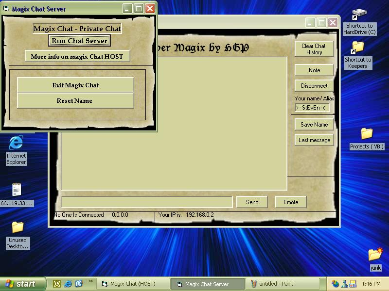



## \_Magix Chat 4\.0 \-  Cool Interface

### Description

This is a chat program that uses winsock.has a cool Age Of Empires Looking Interface.Many good features.Has a host that you can connect to.can open multiple times and chat to multiple people. has sounds to0 , like when some one sends a message , logs off , or connects to host.PLEASE READ THIS!to chat with yourself open the server , ick a port , then open the client and connect to "localhost" with out quotes.Please check it out and leave comments , suggestions and VOTES
 
### More Info
 

             |
---                |---
**Submitted On**   |2003-02-25 17:11:36
**By**             |[Steven Dorman](https://github.com/Planet-Source-Code/PSCIndex/blob/master/ByAuthor/steven-dorman.md)
**Level**          |Intermediate
**User Rating**    |4.4 (22 globes from 5 users)
**Compatibility**  |VB 6\.0
**Category**       |[Internet/ HTML](https://github.com/Planet-Source-Code/PSCIndex/blob/master/ByCategory/internet-html__1-34.md)
**World**          |[Visual Basic](https://github.com/Planet-Source-Code/PSCIndex/blob/master/ByWorld/visual-basic.md)
**Archive File**   |[\_Magix\_Cha1550472252003\.zip](https://github.com/Planet-Source-Code/steven-dorman-magix-chat-4-0-cool-interface__1-43526/archive/master.zip)

